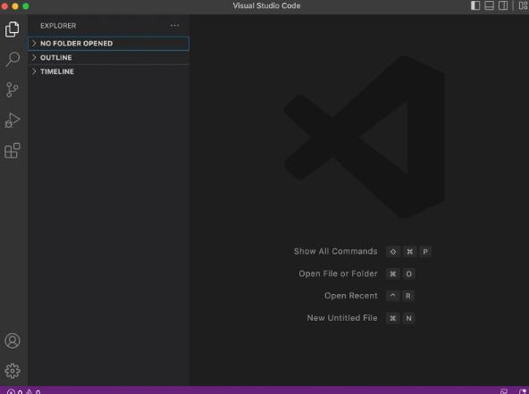
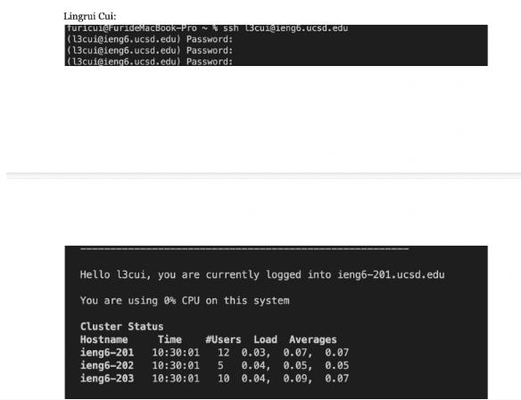
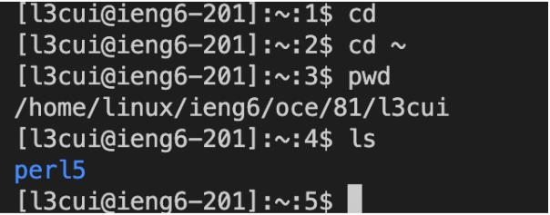
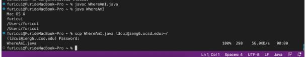
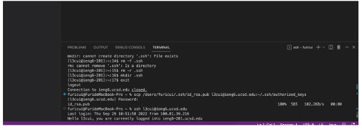
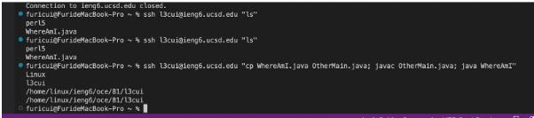

LingruiCui A16800863

Installing VsCode

Download VsCode, open it and click the folder at the up left corner and it is open. and press control shift and ` to open the terminal.
I searched VsCode on the google, and downloaded it. left click to open Vscode. In order to open vscode throught github, I need to go to the website to open the github desktop and then open Vscode through the github desktop.

Remotely Connecting

to remotely log in with “ssh” and my username is l3cui and the password is the password I log in triton. you need to enter the password with no vision! after logging in, it will show that I am currently on the remote computer and how is my CPU doing. And it shows the cluster Status. This means I am already remotely connected.

 
Trying Some Commands
 

tried some commands like pwd, cd and ls in the account l3cui@ieng6.ucsd.edu. just type those words in the terminal to command. As in the picture,cd did not work because I typed wrong command. but pwd prints out the server I am at. and ls does his thing too, so this means After I logged into the server, I can type command to control things in the remote computer.

Moving Files with scp

to scp a file “ secure copy ”, I needed to create a java class first at my local laptop. I created WhereAmI.java and typed command “javac WhereAmI.java” to create a class and run it with java WhereAmI. And it ran well. To scp I also need to enter the password and it showed I uploaded the file successfully.
And scp plus WhereAmI.java and the laptop I want to copied to will just securely copy the file into that computer.

Setting an SSH Key

Using this technology, I found out that everytime I log in or scp need no password since I created a keygen for my pc. and I created a mkdir file in the l3cui account to make the key remembered. The way I did it was doing the scp command to copy the authorized key into my remote computer to let it remember my password in order to not type any password again as I log in.

Maximizing Remote Control

in this part, typing ssh and my account name and the command in “”, it will remotely do the command. And using the semicolon “;”, I can do multiple tasks in 1 sentence! This allows us to control the remote computer without logging and exit back, which actually saved a lot of time as we think it is very efficient to use.
