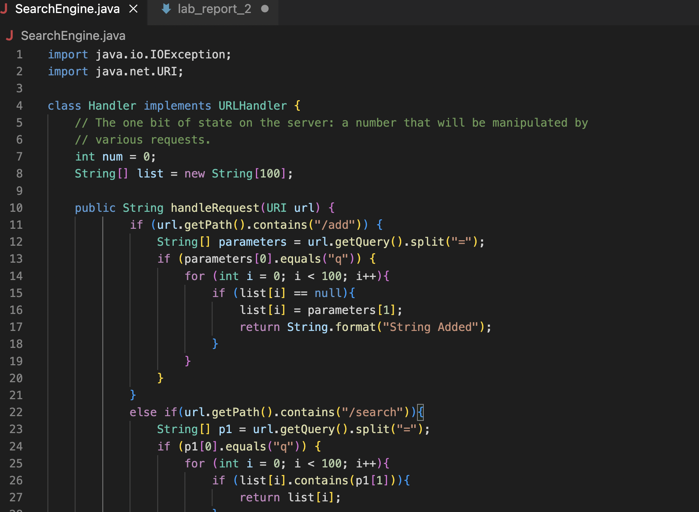
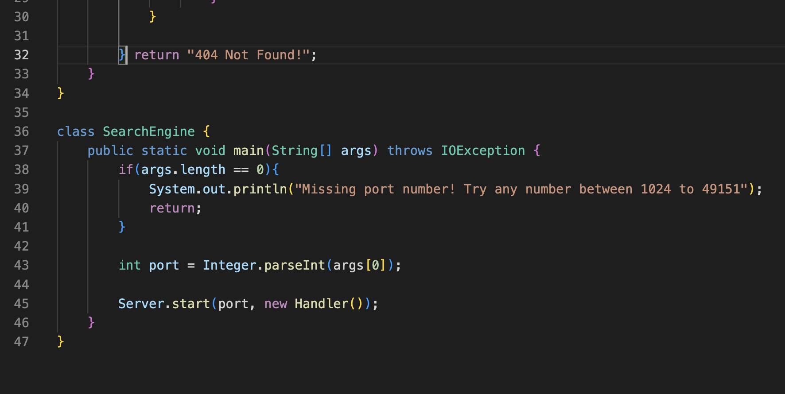
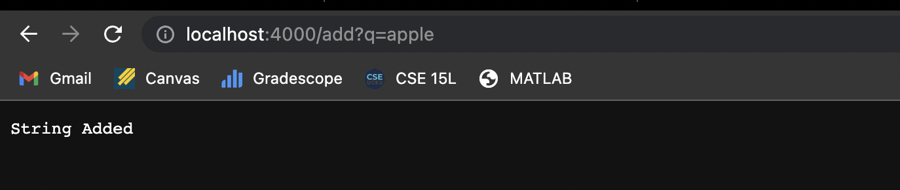
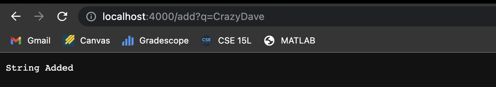
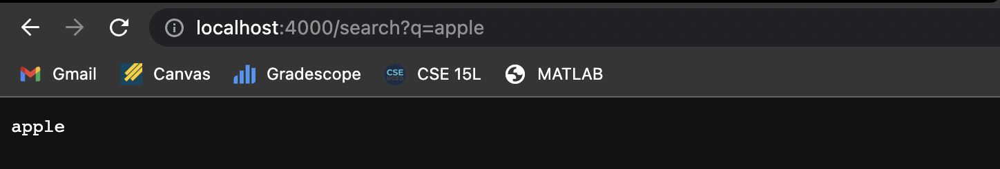
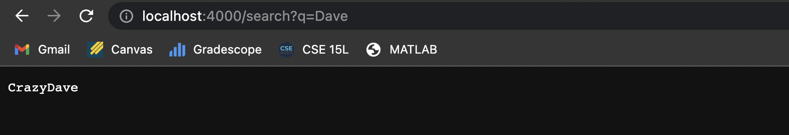

Here are two screenshots of me using the method Add to add a string to the string list. In the web, it prints out what the method is supposed to print(String Added) and the arguments in here we take in method are Dave and apple. They added those two string to the list by detecting a "=" and q in front of it. The argument can be changed by anything and it will just add the argument to the null String list.

Here are two trials that I made with the Search method which just takes the argument which is behind the "=" and search in the previous String list to see if the argument exists. Then, it returns the argument if it exists and otherwise print error.

