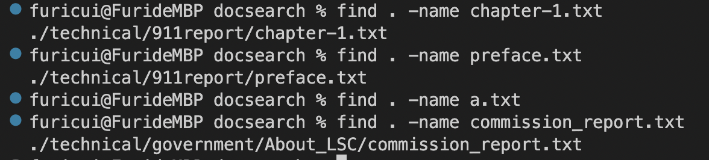
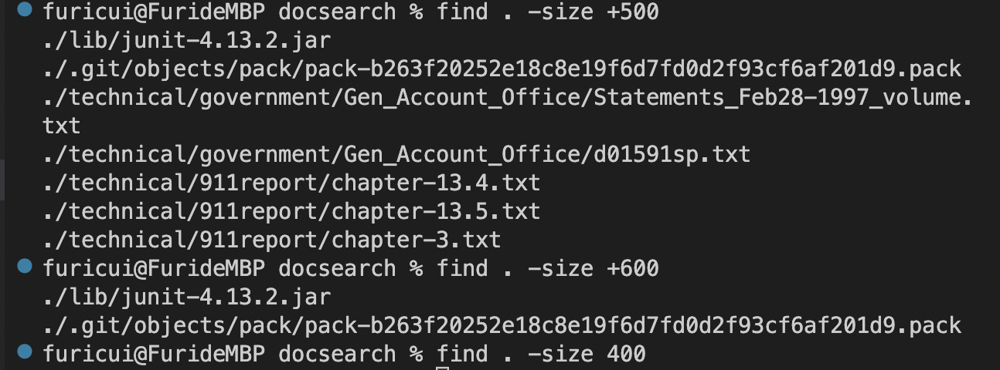
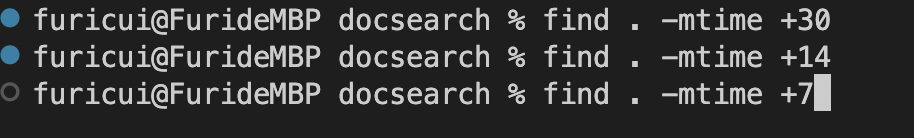
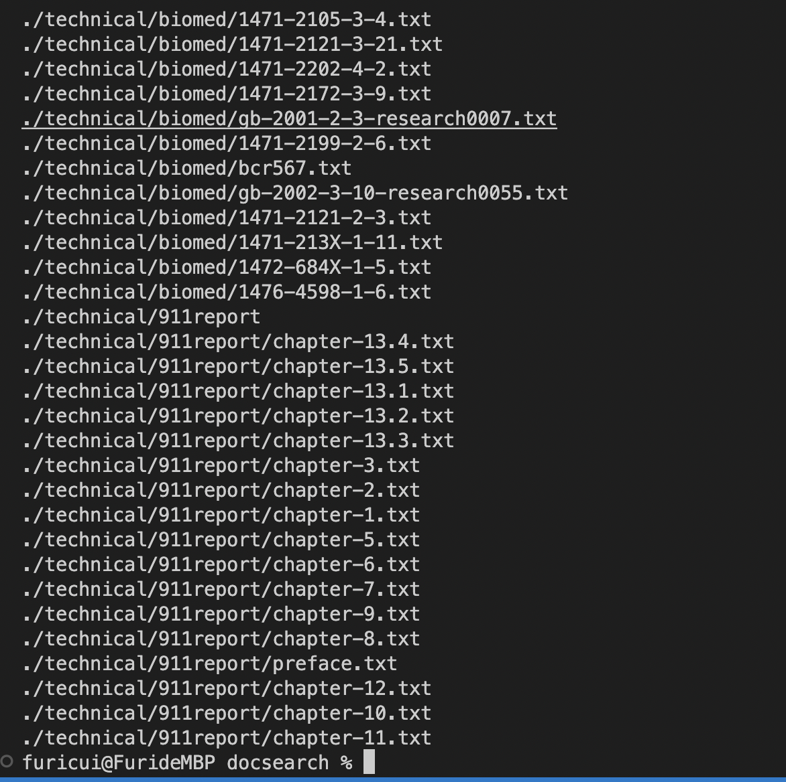

Find Command-Line Option

These Four Command Line I made are Using the option -name for find as the examples. The first one I used to find where the text file named "chapter-1" is located. It shows the path as the output, ./technical/911report/chapter-1.txt. This shows that it is from the file off 911report and from technical. This is a useful command line since it meant to find out the location of the txt file and it saves time under the condition that there are thousands of files. The other command line I used is "find . -name a.txt" which just returned nothing in terminal. This is because a.txt does not exist in the files, therefore it prints out nothing. And last two command lines are the same as the first one, it gives the location of the text file I wanted to find in a line.

As it has shown, the use of the find is to show the location of the files. This option here -size specifies the condition that it is supposed to find the files that are greater than 500 blocks, then it returns that there are indeed couples of files that are greater than 500 blocks. The Junit file is also included in that search and also it is greater than 600 blocks as the next search has shown. The third example I wanted to find the exact 400 blocks file which returned nothing because it is too specific and there does not exist a file that is 400 blocks coincidentally.

These two pictures gives the examples of using find option -mtime, which is easy to understand that it searches the files that are not modified in the modified time as mtime. The first two command lines printed nothing out. This is because there are no files that are not modified in 30 days or 14 days. Though It showed that there are thousands of files that are not modified in 7 days, which just says those files that are printed out are at least being modifed by 14 days and not modified before 7 days.